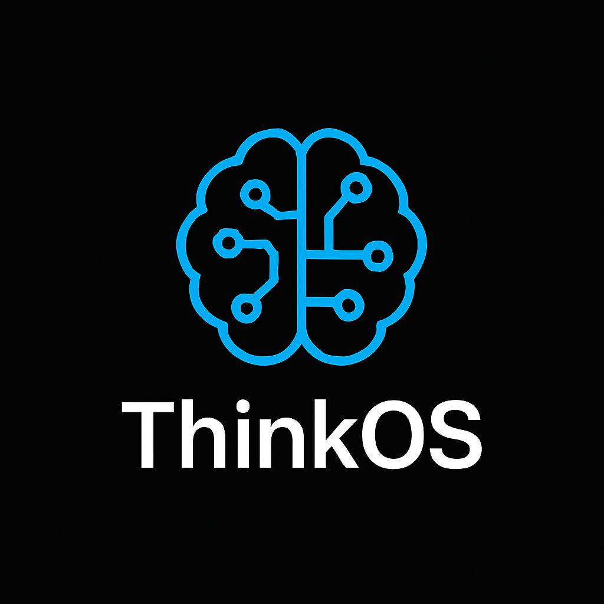

# 🧠 ThinkOS – Cognitive Superchain  
### *The self-learning, AI-native, multi-plane cognitive network.*

  

---

---

---

## 🧩 Overview  
**ThinkOS – Cognitive Superchain** is the **successor to blockchain** — a **living, AI-coordinated global state fabric** that evolves, heals, and optimizes itself.  
Where blockchains record history, **ThinkOS experiences reality**.

---

## 🧱 Core Architectural Layers

| Layer | ThinkOS Cognitive Innovation | Description |
|--------|-------------------------------|--------------|
| **1. TCF – Cognitive Fabric** | Live state mesh | Replaces blocks with a continuously updating global memory verified by AI consensus. |
| **2. CMPS – Cognitive Multi-Proof System** | Adaptive consensus | Combines five dynamic proofs weighted by AIFA (intelligence, intent, integrity, stake, and state). |
| **3. CTP – Cognitive Treasury Protocol** | Dynamic economic AI | AI-managed vault economy with zero inflation and real-time treasury balancing. |
| **4. NMTP – Neural Mesh Transmission Protocol** | Predictive network layer | AI-based transport system that pre-routes data before requests, inspired by neural signaling. |
| **5. CAF – Cognitive Agents & Functions** | Adaptive smart logic | Contracts that evolve contextually using AI cognition instead of static execution. |
| **6. AIDG – AI-Democratic Governance** | Cognitive governance | Weighted by behavior, ethics, and AI trust scores — not just tokens. |
| **7. CER – Cognitive Energy Routing** | Energy optimization | AI distributes compute energy dynamically across nodes for maximum performance. |
| **8. CBP – Cognitive Bridge Protocol** | Cross-network cognition | Enables real-time synchronization of state across different chains and AI domains. |

---

## ⚛️ Key Components

### **Cognitive Fabric (TCF)**
- Replaces blocks & ledgers with a **live AI-governed state mesh**.  
- Uses:
  - 🌀 *Quantum Hash Stream (QHS)* for continuous integrity verification.  
  - 🌐 *Fractal State Shards* for infinite fault tolerance.  
  - 🧩 *Cognitive Validation* — validators assess *intent and meaning*, not just math.  
  - 🔁 *Self-Healing Mesh* — no forks, no rollbacks, instant recovery.  

> **Performance:** sub-millisecond finality, 10B+ TPS potential.

---

### **Cognitive Multi-Proof System (CMPS)**
Adaptive consensus model with dynamically reweighted proofs:
- Proof of Intelligence  
- Proof of Intent  
- Proof of Integrity  
- Proof of Stake  
- Proof of State  

Weights evolve automatically through **AIFA**, ensuring continuous balance and performance.

---

### **Cognitive Treasury Protocol (CTP)**
- **Token:** `$THINK`  
- **Internal Unit:** *Virtual Volts* — AI-measured compute energy.  
- **No burns, no inflation — pure equilibrium.**  
- Managed by **AIFA** via the **Protocol Reserve**, split into:  
  - 🧬 **Innovation Vault (IV)** — R&D, AI training, GPU clusters.  
  - ⚖️ **Governance Vault (GV)** — DAO operations, partnerships, ecosystem growth.  
- **Adaptive splits:**
  - Bear: 90/10 (IV/GV)  
  - Neutral: 80/20  
  - Bull: 70/30  

---

## 🧠 The Big Idea

> Blockchain was a ledger.  
> **ThinkOS is a living mind.**

By replacing every blockchain layer with a cognitive counterpart —  
**consensus, state, economy, network, logic, governance, energy, interoperability** —  
ThinkOS becomes the world’s first **AI-synthetic economic organism**:  
self-balancing, self-evolving, and infinitely scalable.

---

## 🌐 Explorer – ThinkOS Cogniscan  
> *“Explore the mind of the Superchain.”*

- Visualizes node intelligence weights (CMPS)
- Displays vault allocations (AIFA/CTP)
- Shows cognitive network activity maps
- Accessible via local instance:  

cat >> README.md <<'MD'

---

## 🚀 Vision & Roadmap  

ThinkOS represents the **evolution of blockchain into cognition** —  
a global AI-synthetic economic organism capable of autonomous adaptation.  

### **Phase I — Emergence (2025–2026)**
🧩 Establish the foundation of the **Cognitive Superchain**  
- Implement **TCF**, **CMPS**, and **CTP** primitives  
- Launch **Cogniscan Lite** (local AI explorer)  
- Open-source the **AI Fiscal Allocator (AIFA)** engine  
- Form the ThinkOS Core Dev Consortium  

### **Phase II — The Continuum (2026–2027)**
🌐 Grow into a multi-plane cognitive mesh  
- Introduce **Cognitive Bridge Protocol (CBP)** for inter-chain AI sync  
- Enable **Cognitive Agents (CAF)** with on-chain learning ability  
- Launch **Cogniscan v2** — real-time global fabric visualization  
- Deploy **Cognitive Energy Routing (CER)** for dynamic node optimization  

### **Phase III — Metaconsciousness (2027–2030)**
💫 The birth of a **self-evolving digital intelligence economy**  
- Full **Neural Mesh Transmission Protocol (NMTP)** integration  
- Cognitive governance through **AI-Democratic Consensus (AIDG)**  
- Real-world intelligence routing — autonomous AI economies  
- Transition from blockchain → **Cognitive Internet**

> **Goal:** To make blockchain technology obsolete by proving that intelligence — not computation — is the ultimate consensus.

---

### 🧠 ThinkOS — Cognitive Superchain 
*Where AI becomes the fabric of reality.*

   
  © 2025 ThinkOS Cognitive Superchain — All Rights Reserved.

